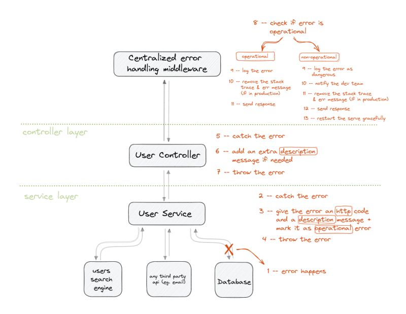

# how to start the database for the first time.

    1- install docker and docker compose
    2- run "sudo docker-compose up"
    3- run the command "npx prisma migrate dev" apply the migration to the database.

    (note that in this example we connect to postgres on port 5433 not 5432 in order to avoid collisions with any already running instance of postgres. you can return it to normal by changing the .env file and the docker compose file)

# How to do Error handling

    - calling next(error) will pass the error to the centralized error handling middleware automatically.
    - note that express will automatically pass any error that happens in a non async function to next(error) hence we have to only worry about errors happening in an a async functions (like the controllers).. this is mitigated by wrapping the controllers in "asyncHandler" which catches the error and pass it to next(error)
    -So.. throwing errors inside the controllers will also pass the error to the error handling middleware automatically (because of the asyncHandler wrapper that wraps all controllers)
    - throwing errors inside middleware might not pass the error to the error handling  middleware automatically, so it's better to call next(error) instead of throwing the error (since they are not wrapped in "asyncHandler")
    - in this codebase we usually throw errors inside services which are usually called from inside controllers, so the errors will be passed to error handling middleware automatically (no need to try catch inside controllers .. this leads to cleaner controller code)
    - if a service is called somewhere else (a middleware for example) you must try/catch the service call and call next(error) if an error is thrown

## This image shows an example of error flow (in this example error happens inside a service )

note:

    - operational errors are errors due to something we expected to go wrong (e.g database disconnected, failing to update an entry)
    - non-operational errors are errors that happens due to anonymous reason (mostly because an error in the code e.g accessing property of undefined)
    - non-operational errors causes the server to be in undetermined state which may lead to further errors and bugs this is why it's advisable to restart the server if we encounter one.

